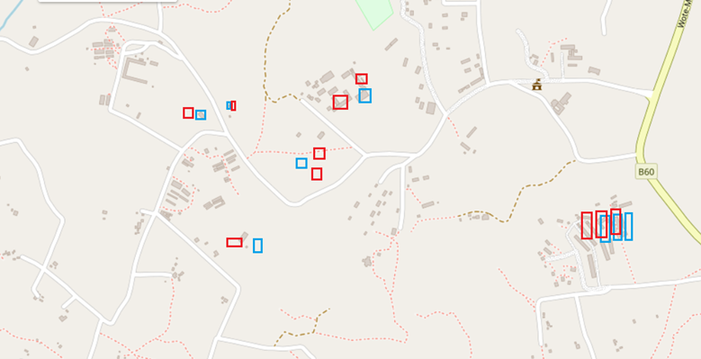
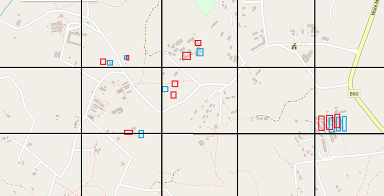
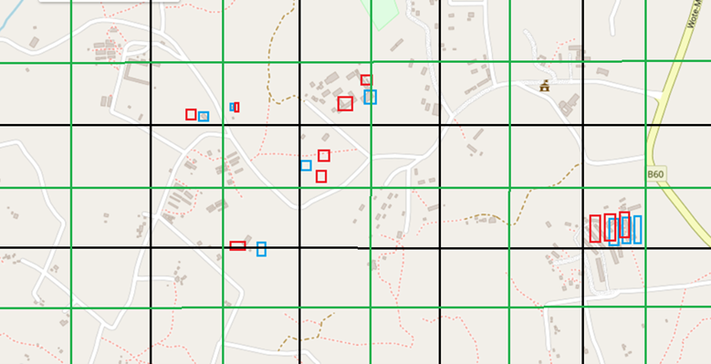

# Data Postprocessing

## Overview

Data post processing contains of such operations over the Open Building Insights data set, which are taken after the building type inferencing either because of their dependency of the result of the machine learning model or due to their optional nature unrelated to the overarching data ingestion process.

## Derive Building Types From OSM Tags

During data curation OSM node and landuse tags are used in a limited extend to derive noise-free training data. In case of OSM landuse the amount of buildings cross-referenced with VIDA is significantly constrained and OSM nodes are cross-referenced with the OSM building footprint data set only.

In the post-processing part all VIDA buildings are cross-referenced with some select OSM landuse tags, such as University, Collage, School, Industrial, etc. and their type is set to non-residential regardless of their VIDA confidence, while the finer-grained classification from OSM is stored in attribute OSM_type.

Similarly, OSM nodes are extracted as 5 times 5 meter large areas allowing to associate them to a single VIDA building footprint based on intersection. In this case a larger radius is selected as VIDA and OSM information is not intended to be “read together” by humans, so the precision between the two sources and their relative location may be “shifted”.

The following tags are obtained for non-residential buildings from OSM and the classification source of impacted buildings is set to “OSM Derived”:
-	Airport Facility
-	Attraction
-	Bank
-	Castle
-	College
-	Commercial
-	Diplomatic
-	Fuel
-	Government
-	Greenhouse
-	Hospital
-	Industrial
-	Mall
-	Monument
-	Office
-	Place Of Worship
-	Power Plant
-	Quarry
-	School
-	Supermarket
-	University

<figure>
  
  <figcaption>Figure 1: An overview of OSM tags processing, overwriting the model provided classification</figcaption>
</figure>  

## Ingest Electricity Related Estimates

Stephen J. Lee created a model to estimate electricity access and electricity consumption of buildings based on several attributes, which is presented in a web tool [OEMaps](#https://www.openenergymaps.org/elec_demand). He provided electricity estimates for **Kenya** for ingestion, which is based on the Google building footprint catalog (different version from VIDA) and OSM. To establish a matching between the two footprint catalogs a complex distributed solution is implemented based on the algorithm called Hungarian Method.

### Problem Statement

Given two different building footprint catalogs for a predefined area, where buildings are represented by their polygons only, without any overarching identification, find a maximal matching of buildings between the two catalogs, where pairs of the matching represent the same physical structure with high probability.

The complexity of the problem arises from the fact, that there is no known correlation between the building footprint catalogs and real-life structures can be projected by a different scale resulting in ambiguity between constituent building footprints.

Additionally, the matching algorithm must be scalable (distributed) to large inputs, even at the cost of providing only near-maximal suitable approximations of the aforementioned matching.

<figure>
  
  <figcaption>Figure 2: Two different building footprint catalogs represented in blue and red, where it can be hard even for humans to guess pairs of footprints representing the same physical building.</figcaption>
</figure>  

### Formally

Two building footprint catalogs are considered as two sets containing elements, for which there is a numeric function called similarity, denoting how similar two given objects are from each other, where zero denotes identical objects. In mathematics similarity is often described by metric distances, which is not mandated under these circumstances.

Given the two input sets a complete weighted bipartite graph is considered, where partitions correspond to the input sets and the weight associated to any edge incident with objects A and B has the value of their similarity.

In this setting the solution is defined by a minimal weight maximal matching in the complete weighted bipartite graph. This matching always covers the smaller partition exactly and has the lowest total similarity score between any maximal matchings.

### Idealistic Solution

There are efficient algorithms to solve the problem of minimal weight maximal matching between a complete weighted bipartite graph. One such algorithm is called Hungarian Method solving assignment problems in graphs. In an ideal solution the entire bipartite graph with each weight should be loaded into memory and the minimal weight maximal matching obtained by the Hungarian Method or any equivalent.

### Scalability Considerations

There are distributed algorithms to solve assignment problems, e.g., https://web.mit.edu/dimitrib/www/Orig_Auction.pdf.

In our case, the geo-spatial nature of the input sets can be used to create an efficient approximation mechanism using several instances of the Hungarian Method algorithm, joining the results into a matching, which empirically provides acceptable results.

### Geo-Spatial Approximate Matching Algorithm

The core idea of the distributed matching algorithm to break down the input sets into smaller chunks based on location. This specifically can be applied in case of building footprint catalogs, as physical proximity increases the possibility of the two footprint being depictions of the same physical structure. Using this observation the entire map can be split into grid cells, which contain manageable amount of buildings, so that it can be processed by Hungarian Method to obtain the minimal weight maximal matching for any given grid cell.

<figure>
  
  <figcaption>Figure 3: An example of splitting an area into cells using a grid, each grid cell can be processed on independently from each other containing only a small portion of building footprints.</figcaption>
</figure>  

Using grid cells it is more probably to match a building to its pair near the center of the cell than at the edges, where the “real” pair of the building footprint might reside in the neighboring grid cell. This problem can be resolved by splitting the map based on two different grids, the second grid being shifted, defined by the centers of the original grid cells. 

<figure>
  
  <figcaption>Figure 4: Example of the two grid system to split a map. The map is split based on the black grid and based on the green grid, each area (and building footprint) becoming part of two grid calls defined by the two colors. Each grid cell – green or black – can be matched independently.</figcaption>
</figure>

The algorithm computes the minimal weight maximal matching for each grid cell, matching each building to at most two different candidates (at most one for each grid definition).

The resulting matching is built by selecting the better of the two candidates for each building as its pair for the matching, considering the notion of similarity used.

### Definitions And Results

Distance factor definition: 1 – 1 / (Distance_between_buildings_centriods)  
Distance_between_buildings_centriods = sqrt(ΔX^2 + ΔY^2) / 8.99*10^-6  
Area factor definition: 1 – building_area_1 / building_area_2  
Building shape factor definition: Δbw1/Δbh1 – Δbw2/Δbh2  
bw = building bounds max width delta  
bh = building bounds max height delta  
Total combined ratio: distance factor + area factor + shape factor  
Total factor is calculated between all buildings in defined tile. Using matching algorithm buildings are matched by min combined ratio factor.  
Split size: 0.2 lon x 0.2 lat tile with overlap 0.005  
Matching size: approx. 840k out of which matched 788k  
Building re-use ratio: out of 788k one to one matched 456k

<figure>
  
  <figcaption>Figure 5: An overview of the ingestion of electricity energy estimates</figcaption>
</figure>

### Lesson Learned

The algorithm proposed is time efficient for small grid tiles, but it is memory intensive. Especially in densely inhabited (built up) areas containing – for the sake of simplicity  - 15000 buildings each the process must store 225 million similarity scores. This caused the matching algorithm  to fail in lack of memory for densely populated tiles around Nairobi.

As a solution a failsafe mechanism is implemented, which decides the most suitable tile size – between 0.2 lon x 0.2 lat tile and 0.1 lon x 0.1 lat tile based on the total amount of buildings in the proximity. This trade-off decreased the memory cost, but due to smaller total amount of building its matching ratio dropped slightly.

## Masking Sensitive Buildings

Information about certain building types can become sensitive, as an example population or electricity estimates can be viewed as sensitive for military related buildings. It is possible to identify military buildings based on OSM tags, which is used to set the building type to **Inactive** and remove all non publicly available information about these buildings. These buildings are still kept in the data set for completeness sake and are drawn as gray inactive buildings on the map page.

<figure>
  
  <figcaption>Figure 6: removing information about sensitive buildings</figcaption>
</figure>

## Implementation Details

The list of most important libraries is provided:

| Package Name | Version | Short Description |
| --- | --- | --- |
| getpass | 1.0.2 | Portable password input |
| jaydebeapi | 1.2.3 | Use JDBC database drivers from Python 2/3 or Jython with a DB-API. |
| jpype | 1.4.1 | A Python to Java bridge. |
| json | default | A library to work with JSON documents. |
| geopandas | 1.0.1 | Geographic pandas extensions |
| pandas | 1.5.3 | Powerful data structures for data analysis, time series, and statistics |
| pyproj | 3.6.1 | Python interface to PROJ (cartographic projections and coordinate transformations library) |
| shapely | 2.0.5 | Manipulation and analysis of geometric objects |
| numpy | 1.23.5 | Fundamental package for array computing in Python |
| requests | 2.31.0 | Python HTTP for Humans. |
| ibm_boto3 |  | The IBM SDK for Python |
| botocore | 1.27.59 | Low-level, data-driven core of boto 3. |
| ibm_cloud_sdk_core | 3.20.3 | Core library used by SDKs for IBM Cloud Services |
| threading | default | Standard threading module |
| scipy | 1.14.0 | Fundamental algorithms for scientific computing in Python |
| overpy | 0.7 | Python Wrapper to access the OpenStreepMap Overpass API |

## Execution Details

To execute the data curation process the following notebooks are executed in order:
1.	OSM_labeled_data_DB2_Update.ipynb
2.	building_matching.ipynb
3.	ingest_energy_estimations_Kenya.ipynb
4.	mask_buildings.ipynb
 